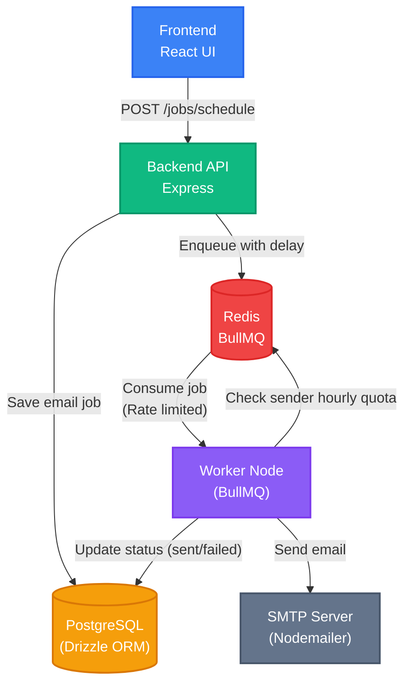

<div align="center">

  <h1>OBVC Email Scheduler</h1>

  <p>
    A full-stack email scheduling application.
  </p>

  <p>
    <a href="https://react.dev/">
      
    </a>
    <a href="https://nodejs.org/">
      
    </a>
    <a href="https://bullmq.io/">
      
    </a>
    <a href="https://redis.io/">
      
    </a>
    <a href="https://postgresql.org/">
      
    </a>
    <a href="https://docker.com/">
      
    </a>
  </p>

</div>

<hr />

## Table of Contents
**1. [Technical Architecture](#1-technical-architecture)<br>
2. [Features](#2-features)<br>
3. [Local Setup](#3-local-setup)<br>
4. [How it Works](#4-how-it-works)<br>**

---

## 1. Technical Architecture



## 2. Features

- **Email Scheduling:** Compose emails and pick exact dates/times for them to be sent in future.
- **Global Rate Limiting:** Enforces a minimum delay (e.g., 2 seconds) between every sent email across the system.
- **Hourly Quotas:** It tracks & limits how many emails a specific sender can dispatch per hour (e.g., 200/hr max).
- **Background Processing:** A service based worker architecture ensures that the API calls are fast while heavy email sending happens in the background.
- **Dockerized Environment:** The entire stack (Frontend, Backend API, Worker, Redis, Postgres) is orchestrated via Docker Compose for easy local development and testing.

## 3. Local Setup

### Prerequisites
- Docker and Docker Compose
- Node.js (v24+) & pnpm (for local development/tooling)

### Environment Variables
The project uses a `.env` file for configuration. Copy the provided `.env.example` to get started:

```bash
cp .env.example .env
```

This configuration file controls several key areas of the application:
- **Database & Cache:** `DATABASE_URL` and `REDIS_URL` used by the API and Worker to connect to the backing services.
- **SMTP Credentials:** `ETHEREAL_*` variables where you place your mock SMTP credentials generated from [Ethereal Email](https://ethereal.email) to safely test sending.
- **Rate Limiters:** Adjust `MIN_DELAY_MS` (delay between consecutive emails) and `MAX_EMAILS_PER_HOUR` (hourly quota per sender) to control the throughput of the background worker.

### Start the Stack
Bring up the all the services using Docker Compose. This spins up the Postgres database, Redis, backend API, frontend React app, and the background worker.

```bash
docker compose up --build
```

### Push Database Schema
Once the containers are running and healthy, open a new terminal tab and apply the database schema so the tables are created in Postgres:

```bash
docker compose exec backend pnpm run db:push
```

### Access the Application
- **Frontend UI:** Navigate to `http://localhost:5173`
- **Backend API:** Running on `http://localhost:3000`

## 4. How it Works

### How Scheduling Works
When an email is scheduled via the frontend, the backend computes the delay in milliseconds (`scheduledTime - currentTime`). The job is then inserted into BullMQ with this `delay` parameter. BullMQ holds onto the job in Redis until the delay expires, after which the Worker picks it up for processing.

### Persistence on Restart
The system makes sure no emails are lost during crashes or restarts:
1. **PostgreSQL Data Volume:** All email metadata, recipient info, and statuses (`scheduled`, `sent`, `failed`) are stored in Postgres, backed by a persistent Docker named volume (`local_postgres_data`).
2. **BullMQ State:** Jobs in the queue are managed by Redis. If the Node.js worker crashes or is restarted, it will automatically reconnect to Redis and resume processing exactly where it left off, including following the active rate limits.

### Rate Limiting & Concurrency
Rate limiting is handled at two distinct layers inside the Worker:
1. **Per-Email Delay (BullMQ Limiter):** The worker uses BullMQ's native `limiter: { max: 1, duration: MIN_DELAY_MS }` configuration. This makes sure that regardless of how many emails are queued, the worker pauses for `MIN_DELAY_MS` between each email send.
2. **Hourly Sender Limits (Redis Keys):** Before sending, the worker increments a Redis key tied to the sender and the current hour (e.g., `sender:123:2024-08-08T15`). If the count exceeds `MAX_EMAILS_PER_HOUR`, the worker aborts the send and automatically re-enqueues the job to be processed at the start of the next hour.
3. **Concurrency:** Configured via `WORKER_CONCURRENCY`, determining how many jobs the worker will process simultaneously/concurrently.